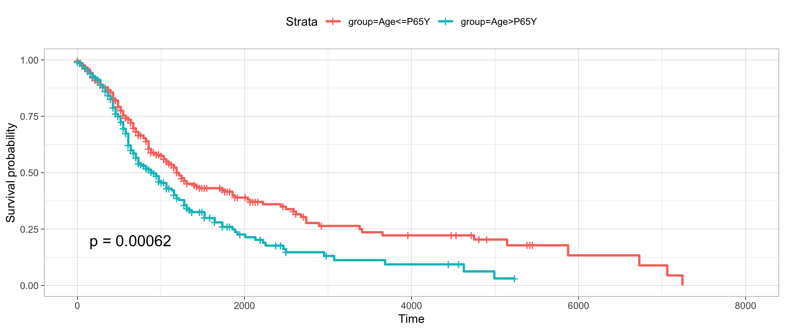

# pgxRpi, an R Library to Access Progenetix Data

`pgxRpi` is an API wrapper package to access data from Progenetix database. For more detailed documentation, please visit the [GitHub repository](https://github.com/progenetix/pgxRpi). 

## Retrieve available filters 

Filters are rules to select records based on their field values, allowing for precise queries in Progenetix. More details about filters can be found [here](https://docs.progenetix.org/common/classifications-and-ontologies/). 

The following code retrieves filters with the `NCIT` prefix:

```
ncit_filters <- pgxFilter(prefix="NCIT") 
```

## Retrieve biosample information 

You can retrieve biosample information from specific groups of interest, selected using a filter.

```
biosamples <- pgxLoader(type="biosamples", filters = "NCIT:C3512")
```

The returned biosample information includes details such as biosample ID, tumor types, tumor stage, and associated literature or research projects.

## Retrieve individual information 

You can retrieve information about individuals from whom samples are derived, including survival data.

```
individuals <- pgxLoader(type="individuals", filters = "NCIT:C3512")
```
## Visualize survival data 

You can visualize the survival differences between younger and older patients based on the queried individual information. 

```
pgxMetaplot(individuals,group_id="age_iso", condition="P65Y", pval=TRUE)
```



## Query and export segment copy number variant data 

You can download the copy number variant data of individual biosamples. The biosample ID can be obtained via pgxRpi or the [Progenetix website](http://progenetix.org/biosamples/).

The variant data export supports different output formats. For more information, refer to the package vignettes.

```
pgxLoader(type="g_variants", biosample_id = c("pgxbs-kftva6du","pgxbs-kftva6dx"),output = "pgxseg", save_file=TRUE)
```

## Query CNV fraction data of biosamples from specific cohorts

CNV fractions are calculated based on segment data across various genomic scales, such as 1MB genomic bins, chromosomal arms, whole chromosomes, or the entire genome (GRCh38).

```
cnv_fraction_across_chro_genome <- pgxLoader(type="cnv_fraction", filters = "NCIT:C2948")
cnv_fraction_across_bin <- pgxLoader(type="cnv_fraction", filters = "NCIT:C2948", output="pgxmatrix")
```

## Query and visualize CNV frequencies 

You can query the CNV frequency of specific filters. There are two available data formats. One is [`.pgxfreq`](https://docs.progenetix.org/file-formats/#pgxfreq-segment-cnv-frequencies). Another is [`.pgxmatrix`]([https://docs.progenetix.org/services/#cnv-frequency-matrix].

```
frequency <- pgxLoader(type="cnv_frequency", output ='pgxfreq',
                         filters=c("NCIT:C4038","pgx:icdom-85003"))
```
```
pgxFreqplot(frequency, filters='pgx:icdom-85003')
```


```
pgxFreqplot(frequency, filters='NCIT:C4038',chrom=c(1,2,3), layout = c(3,1))
```


```
pgxFreqplot(frequency,filters= c("NCIT:C4038","pgx:icdom-85003"),circos = TRUE) 
```


