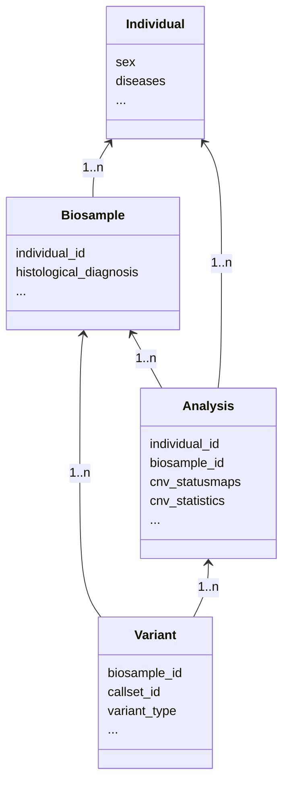
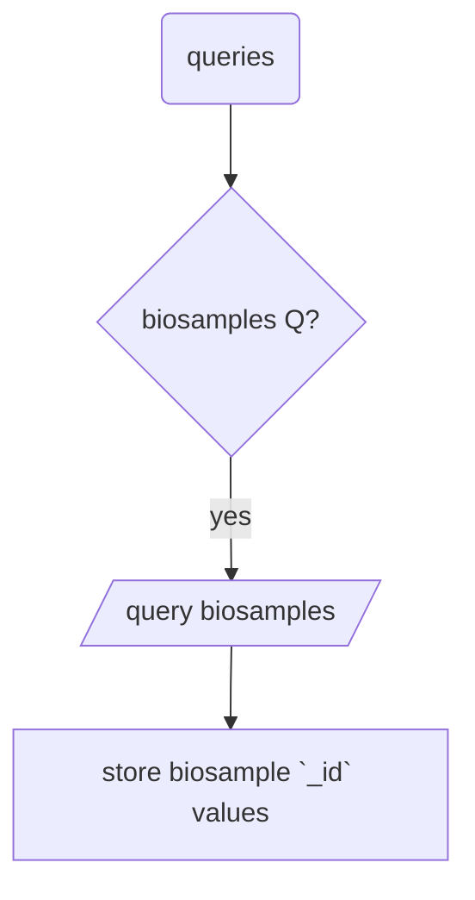

# Technical Notes

## Genomic Intervals and Binning

The resource uses a standard CNV binning model with (in GRCh38) 3106[^1] intervals
of 1MB default size. Binned genome CNV values are available for all individual
analyses (genome profiles), indicating the interval's involvement in one or more
CNV events, separated for gains and losses.

Additionally, for all all _collations_ (e.g. profiles of a tumor type, or from
the same publication), pre-computed interval CNV frequencies are available
Alternatively, interval frequency maps can be generated on the fly from
e.g. search results.

The binning does _not_ apply to the variant data itself; i.e.
genomic variants are stored and being queried with their original parameters.

### Binning Procedure

Binned CNV mappings are generated through utility functions in the
[**bycon**](http://github.com/progenetix/bycon/) package:

* a standard set of 1Mb genomic intervals (0-based interbase coordinates)
is generated (with the last bands at pter and qter potentially differing in size)
using coordinates from the current (GRCh38) cytoband mapping file
* for each analysis/analysis, all its CNV variants are collected and for each
of the (currently 3106) intervals the sum of variant intersections is used to
calculate the overlap fraction, for gains and losses separately (accommodating
for the smaller sizes of q-telomeric bins)
* additionally, the maximum and minimum CNV values (log2) are stored for each bin

As a result, all samples have now 2x3106 values for gain and loss overlap fractions
as well as - for samples with accessible original data - relative CNV intensities.

### Frequency Maps

CNV frequencies are calculated for collations, or samples from search results, by
counting the occurrences of non-zero status values for all given intervals in the
selected samples, with an optional filter for a minimal fraction.

More information is made availanble in the [Use Cases](use-cases.md) category.

---

## CNV Profile Clustering

The Progenetix CNV visualization includes some default clustering for sample CNV profiles and
collation CNV frequencies.

The resource uses a standard [CNV binning model](#genomic-intervals-and-binning)
with (in GRCh38) 3106[^1] intervals of 1MB default size. For the clustering of both status and
frequency values, gain and loss intervals are treated independently, resulting in 6212[^1]
values per sample (or collation) for the generation of a clustering matrix:

* for sample clustering, the cluster matrix for each sample (line) consists of the
fraction of each 1Mb bin covered by a gain (resp. loss) in this sample
  - this results for CNVs larger than 1Mb in several bins with `1.000`, and then the edge bins with values below 1
* for CNV frequencies (e.g. comparing results for different cancer types) the values are the percents of samples having a CNV of the given type per 1Mb bin

On the website sample and/or collation clustering is involved automatically on the
"Data Visualization" page which can be accessed from the search results. Clustering as
well as CNV visualization are performed through the [**bycon**](http://github.com/progenetix/bycon/)
library[^1] with default parameters:

* `m`: pairwise complete-linkage clustering
* `e`: Euclidean distance

For visualization, while clustering is performed on the matrix with separate values for gains and losses, the plotting is then performed on the original data:

* samples are ordered as determined from the clustering, but then the original non-binned CNV segments are plotted along the genome
  - this results in the natural sequence of gain and loss segments, **not** in a separate display
* for CNV frequencies, a mixed color is generated fro the combined gain and loss values for each 1Mb bin
  - technically, each of the red, green, blue channels of the RGB values for the gain and loss frequencies the channel values for DUP and DEL are added, normalized for the overall maximum CNV frequency in the data  

```Perl
for my $i (0..2) {
    $dupRGB->[$i] = int($dupRGB->[$i] * $dupF / $maxF);
    $delRGB->[$i] = int($delRGB->[$i] * $delF / $maxF);
    if (($dupRGB->[$i] + $delRGB->[$i]) < 255) {
        $RGB[$i] = $dupRGB->[$i] + $delRGB->[$i] }
    else {
        $RGB[$i] = 255 }
}
```

Clustering can be omitted by setting `Cluster Tree Width` to `0`.

More information is made availanble in the [Use Cases](use-cases.md) category.

[^1]: Before 2022-02-11 there where 3102 (or 6204) intervals. After this, a changed algorithm lead to
avoidance of centromere-spanning intervals, i.e. shortened last intervals assigned to the chromosomal
p-arm and downstream shifts of interval positions.

---

## Data Model & Database

The Progenetix data model is based on a hierarchy in which `variant`s are from `analysis`s (or "analyses")
which are based on material from `biosample`s which were derived from `individual`s.

These entities are represented in a MongoDB database with eponymous collections:

* variants
* callsets
* biosamples
* individuals



## Data Query Model

==TBD==


[^1]: Before April 2023 clustering and CNV visualization were performed using the
[**PGX**](http://github.com/progenetix/PGX/) Perl libraries.