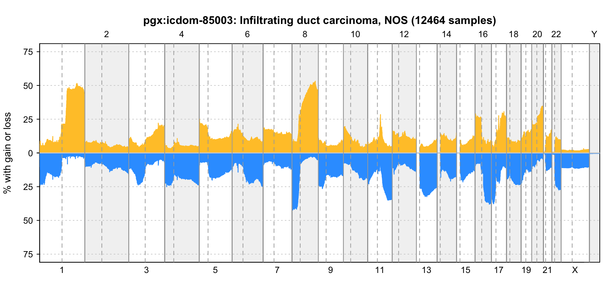
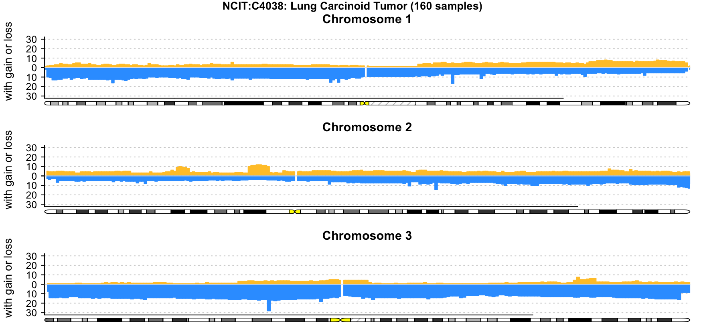
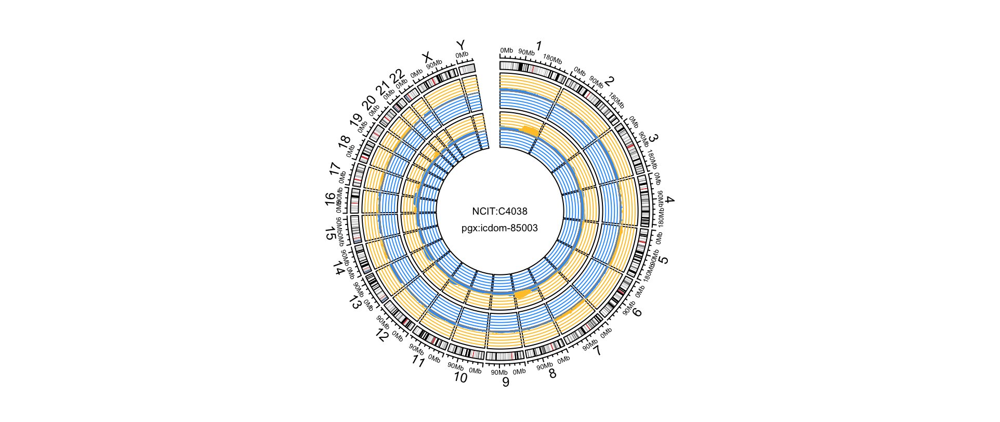

# Use Cases

## Explore Gene CNVs

One of the main use cases for the Progenetix resource is the exploration of frequency and disease specificity of genes of interest. Traditionally, the relevance of somatic CNVs hitting a gene in the context of cancer are judged by

* the CNV frequency (i.e. in what fraction of samples the a CNV in this gene is being observed)
* the relative specificity, i.e. how CNVs in this gene compare to
    - the overall amount of CNVs in the samples
    - the local specificity, i.e. the "focality" of the CNVs

The [Progenetix Search Page](http://progenetix.org/biosamples/) supports the exploration of regional CNVs through

* support for inserting positions of genes or cytobands into standard Beacon query parameter fields
* selection support for hierarchical disease annotations
* providing example queries as templates

The response of the queries for genomic variants provide some basic statistics, e.g. the relative frequencies of these variants for each classification code (e.g. NCIT, ICD-O) encountered in teh matched samples.

### Example Procedure

**TBD**

---

## Visualize CNV patterns

The Progenetix resource contains pre-computed CNV frequency profiles for all diagnostic
and technical (e.g. derived from a publication or technical platform) categories. These
profiles provide a rapid overview of CNV events along the genome but also can serve for
the exploration of possible genomic subsets hidden behind the overview profiles.


#### CNV profile clustering


### Example Procedure

**TBD**

---

## Download or Plot CNV Frequencies

### Collation plots

The Progenetix resource provides pre-computed CNV frequencies for all its
"collations" such as

* cancer types by e.g. NCIt, ICD-O morphology and topography codes
* experimental series, e.g. all samples from a given publication
* custom cohorts, e.g. all samples used in a Progenetix meta-analysis or
external project such as TCGA

This data can be accessed through the Progenetix API in data and image format.


Interval frequencies are per default stored in a 1Mb binned format. More
information about the API use can be found [in the IntervalFrequencies API documentation](services.md#pgxseg-segment-cnv-frequencies).

### Query-based histograms

The Progenetix Beacon responses - depending on their type - usually contain a _handover_
URL to retrieve CNV histogram and/or sample plots of the samples matched by the query.
The `bycon` API now offers a direct access to the histograms without the need to deparse
JSON response first. The switch to the histogram is ionitiated by adding `&output=histoplot`
to the Beacon query URL. Then, the API will first query the samples and then perfor
a handover to the plotting API. Please be aware that this procedure is best suited for limited
queries and may lead to a time-out.

#### Examples:


* [progenetix.org/beacon/biosamples/?referenceName=9&variantType=EFO:0030067&start=21500000&start=21975098&end=21967753&end=22500000&filters=NCIT:C3058&filters=pgx:cohort-celllines&output=histoplot](http://progenetix.org/beacon/biosamples/?referenceName=9&variantType=EFO:0030067&start=21500000&start=21975098&end=21967753&end=22500000&filters=NCIT:C3058&filters=pgx:cohort-celllines&output=histoplot)
    - a search for samples with focal deletion in the _CDKN2A_ locus, limited to glioblastoma cell lines 


### Example Procedure - Download CNV Frequencies

Typical cases for the use of collation-specific frequency data could be e.g.
the visualization of CNV tracks with 3rd party tools such as [Circos](http://www.circos.ca/software/)
or integration in data analysis workflows, e.g. for comparing target genes to
local, disease-specific CNV frequencies.

#### Getting cancer type CNV frequencies

All cancer codes for a given classification system can be retrieved though:

* NCIT
    - [progenetix.org/services/collations?filters=NCIT&output=text](http://progenetix.org/services/collations?filters=NCIT&output=text)
* ICD-O Morphologies
    - [progenetix.org/services/collations?filters=icdom&method=counts&output=text](http://progenetix.org/services/collations?filters=icdom&method=counts&output=text)
    - please be aware that we have to use transformed ICD-O codes; e.g.
  "ICD-O 8500/3" is represented as `pgx:icdom-85003` (`s/^(\d{4})\/(\d)$/pgx:icdom-$1$2/`)
* ICD-O Topographies
    - [progenetix.org/services/collations?filters=icdot&method=counts&output=text](http://progenetix.org/services/collations?filters=icdot&method=counts&output=text)

#### Download the data file

For any of those codes one can create a `.pgxseg` file downloader link for the
["IntervalFrequencies" service](services.md#pgxseg-segment-cnv-frequencies):

##### Examples

* [progenetix.org/services/intervalFrequencies/?output=pgxseg&filters=NCIT:C105555](http://progenetix.org/services/intervalFrequencies/?output=pgxseg&filters=NCIT:C105555)
* [progenetix.org/services/intervalFrequencies/?output=pgxseg&filters=icdom-85003](http://progenetix.org/services/intervalFrequencies/?output=pgxseg&filters=icdom-85003)


### Example Procedure - Download or embed CNV frequency plot

For the generation of CNV frequency plots, the same procedure as above for
identifying existing frequency maps can be applied. CNV hsitograms in [SVG format](services.md#image-formats)
can be generated for download or embedding through a canonical service URL with
added (single) collation code.


##### Examples

* [progenetix.org/services/collationPlots/?id=pgx:icdom-85003](http://progenetix.org/services/collationPlots/?id=pgx:icdom-85003)
* [progenetix.org/services/collationPlots/?id=PMID:22824167](http://progenetix.org/services/collationPlots/?id=PMID:22824167)

--------------------------------------------------------------------------------

## Download Sample Data

The sample annotations for any type of query - particularly but not limited to
single identifier values - can be downloaded in either [Beacon v2 JSON](beaconplus.md#beacon-api)
or in a tab-delimited text format (`&output=table`).

##### Examples

* Download all TCGA cancer samples from Progenetix as tab-delimited table
      - [progenetix.org/beacon/biosamples/?filters=pgx:cohort-TCGAcancers&output=table](http://progenetix.org/beacon/biosamples/?filters=pgx:cohort-TCGAcancers&output=table)

--------------------------------------------------------------------------------

## pgxRpi, an R Library to Access Progenetix Data

`pgxRpi` is an API wrapper package to access data from Progenetix database. More details about this package are in the [vignettes](https://github.com/progenetix/pgxRpi). There are several functions in this R package.

### Retrieve biosample information 

You can select biosamples from specific groups of interests, chosen by a filter. The description about _filters_ is [here](https://docs.progenetix.org/classifications-and-ontologies/).

```
biosamples <- pgxLoader(type="biosample", filters = "NCIT:C3512",codematches = TRUE)
```
The returned biosample information includes biosample id, various codes for tumor types, tumor stage, survival data, associated literature or research project, etc.

### Query CNV coverage data of biosamples from specific cohorts

The coverage is calculated across 1MB genomic bins, chromosomal arms, whole chromosomes, or whole genome.

The CNV coverage across genomic bins can be accessed by setting `output` = "pgxmatrix". More details about the data format "pgxmatrix" see the [documentation](https://docs.progenetix.org/services/#cnv-status-matrix).

```
cnv.status <- pgxLoader(type="variant", filters = "NCIT:C3058", output="pgxmatrix", codematches = T)
```

The CNV coverage across chromosomal arms, chromosomes, or whole genome can be accessed by setting `output` = "coverage".

```
cnv.status <- pgxLoader(type="variant", filters = "NCIT:C4443", output="coverage", codematches = F)
```

### Query and export segment copy number variant data 

You can download the copy number variant data of individual biosamples. The biosample id can be queried by pgxRpi or by Progenetix [website](http://progenetix.org/biosamples/).
The variant data exportation supports different output formats, more information see vignettes.

```
variants <- pgxLoader(type="variant", biosample_id = c("pgxbs-kftva6du","pgxbs-kftva6dv","pgxbs-kftva6dx"),output = "pgxseg")
```

### Query and visualize CNV frequencies 

You can query the CNV frequency of specific filters, namely specific cohorts. There are two available data formats. One is [`.pgxseg`](https://docs.progenetix.org/services/#pgxseg-segment-cnv-frequencies), good for visualization. Another is [`.pgxmatrix`](https://docs.progenetix.org/services/#cnv-frequency-matrix), good for analysis.

```
frequency <- pgxLoader(type="frequency", output ='pgxseg',
                         filters=c("NCIT:C4038","pgx:icdom-85003"), 
                         codematches = TRUE)
```

The data visualization requires the input data with `.pgxseg` format. You can plot the frequency by genome, by chromosomes, or plot like circos.

```
pgxFreqplot(frequency, filters='pgx:icdom-85003')
```



```
pgxFreqplot(frequency, filters='NCIT:C4038',chrom=c(1,2,3), layout = c(3,1))
```



```
pgxFreqplot(frequency,filters= c("NCIT:C4038","pgx:icdom-85003"),circos = TRUE) 
```



 --------------------------------------------------------------------------------

## User-Provided CNV Data

The Progenetix resource has a limited option to visualize CNV data provided by the users. Data has to be formatted in a standard tab-delimited columnar format, preferably using the [`.pgxseg` file format](services.md#data-file-formats-pgxseg-segments). Additional information can be found on the upload service page:

* [Upload Files for CNV Visualization](http://progenetix.org/service-collection/uploader/)

The data is only temporary stored on the server with a randomiized access path. At this time we do not provide any long term or login protected data storage and do not store access data.

#### Example Procedure

**TBD**

--------------------------------------------------------------------------------
