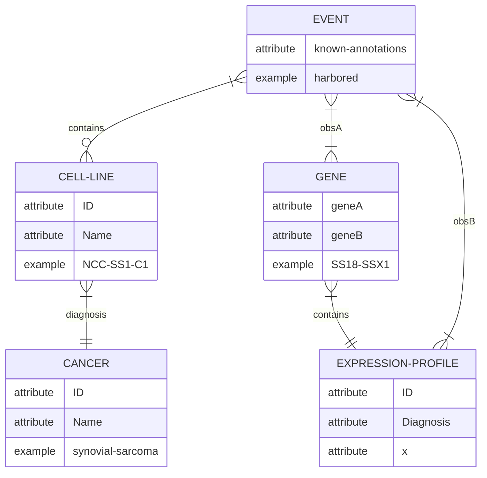

## Progenetix data ER-diagram

Example sentence: Primary tumor and **NCC-SS1-C1 cell line** _harbored_ the **SS18-SSX1 fusion gene** typical of **synovial sarcoma** and similar proteomics profiles.

### **Use cases for resulting data in Progenetix:**
1. Single nucleotide variant (SNV) correlations. We have a collection of SNVs (i.e. annotated mutations) for the cell lines for which we have copy number profiling data in Progenetix. Here we would like to look into mappings and correlations of text-mined gene data with those annotated mutations, either for direct statistics (genes w/ annotated variants vs. mined genes) as well as network proximity (STRING etc.) of mined genes with the mutation events. 
2. Affected genes in genomic copy number variants (CNVs) of cell lines. While many large scale genomic amplifications and deletions in cancers are driven by tumor inducing or repressing genes respectively, the extend of such mutations in many cases does not allow for a direct assignment of individual target genes. Here, putative, cell-line related candidate genes from text extractions can serve for the evaluation of such genes as potential targets of CNV events. We would like to explore how these affected genes relate to our CNV profiling data. 
* Overall we are interested in data from **articles** with some (scored) **association** between **_cell line ids_** and **_gene symbols_** as a read-out, as well as additional **_article metrics_** (techniques, disease terms, sample numbers…)